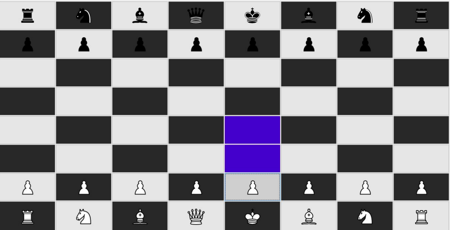
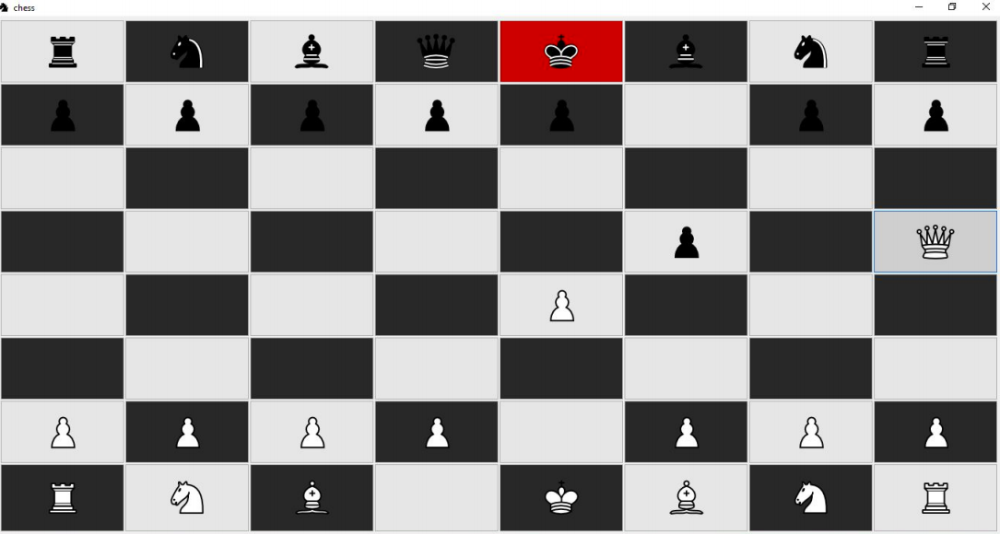
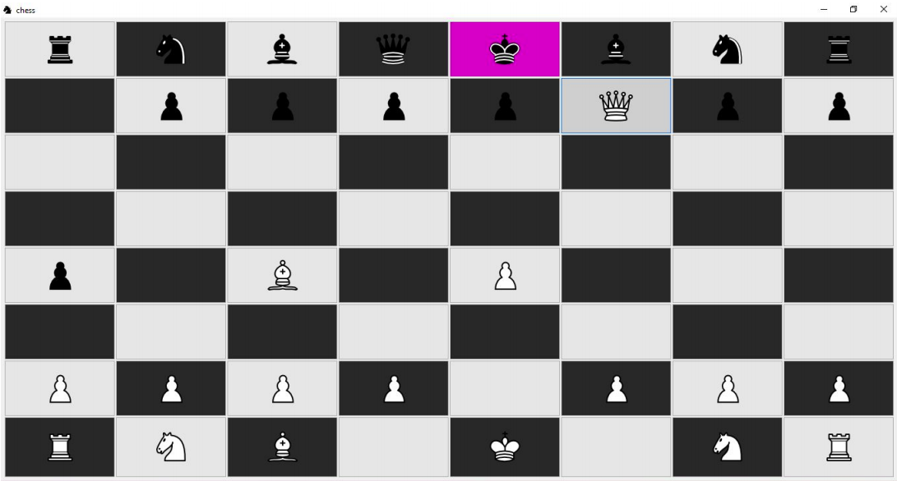

# Chess 
## Desktop chess app, written in java.
### Supports:
* #### Online multi-player chess game.
* #### Beautiful design.
* #### Lights possible moves for selected tool.
* #### Colors king square in red on chess.
* #### Colors king square in purple on chess-mate and finishes game.
* #### Allows only legal move of the tools.

### Screenshots
#### Opening board

#### Chess

#### Chess-mate

